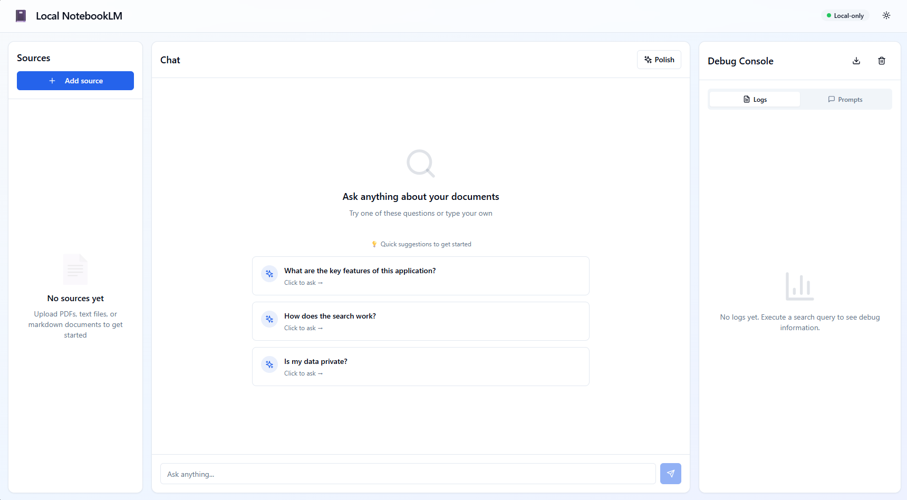

# Local NotebookLM

A privacy-focused, browser-based personal search assistant that runs 100% locally. Upload PDFs and documents, ask questions, and get cited answers—all without sending your data anywhere.

## Goal

This project demonstrates how to build a fully local document search and question-answering system using modern web technologies. All processing happens in the browser using WebAssembly-based ML models (Transformers.js), with no backend servers or cloud APIs required.

It combines lexical search (BM25) and semantic search (vector embeddings) to provide accurate, cited answers from your documents while keeping all data completely private and offline-capable.

---



---

## Getting Started

### Prerequisites
- Node.js 18+

### Development

```bash
cd app
npm install
npm run dev
```

Visit `http://localhost:5173` to see the app.

### Build

```bash
npm run build
```

The static site will be in `/app/dist`.

## License

MIT License - see LICENSE file for details.
